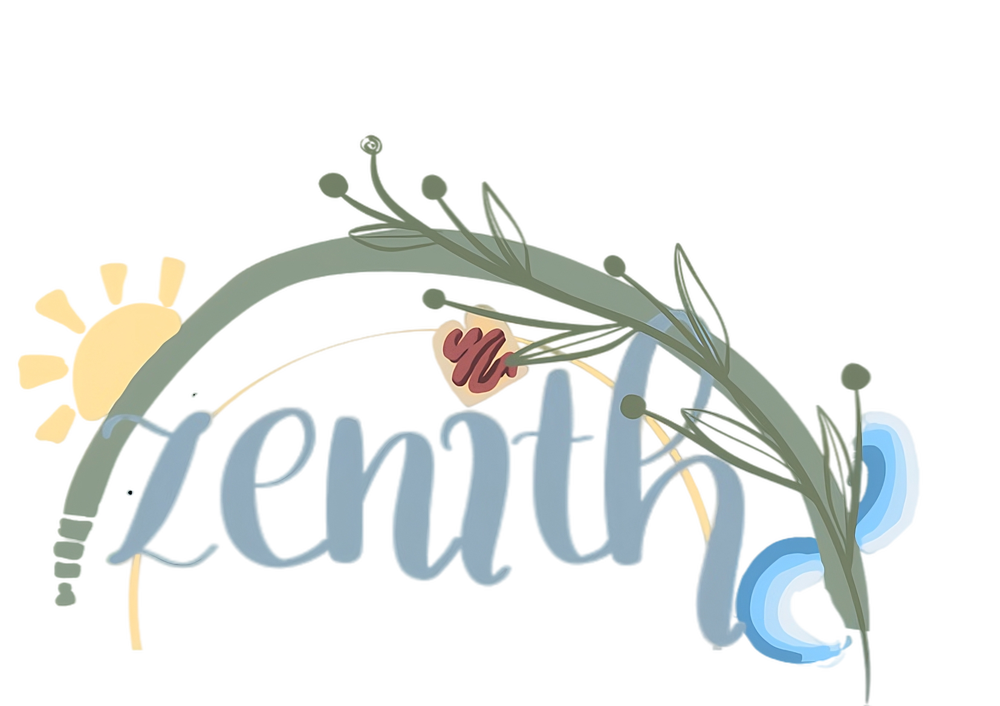

<p align="center">
  
</p>

<h1 align="center">Zenith — Frontend</h1>

<p align="center">
  <strong>AI-powered student wellness dashboard</strong><br/>
  Financial literacy · Academic support · Health & vitals tracking
</p>

<p align="center">
  
  
  
  
</p>

---

## Overview

Zenith is a full-stack AI wellness platform for students. This repo contains the **Next.js frontend** — a Material Design 3 interface with GSAP-powered animations, a JARVIS-inspired AI dashboard, interactive utility tools, and dynamic weather effects.

### Key Features

| Feature | Description |
|---|---|
| **Three AI Sections** | Guardian (financial), Scholar (academic), Vitals (health) — each with its own AI assistant |
| **JARVIS Dashboard** | AI brief generation, stat rings, live chat, and "Try Asking" quick prompts |
| **Utility Toolkit** | BMI calculator, compound interest, TDEE, caffeine tracker, heart rate zones, and more |
| **Personalized Survey** | Window-based onboarding survey that fine-tunes AI responses to each student |
| **Material Design 3** | 10+ theme variants with full light/dark mode support and glassmorphism surfaces |
| **GSAP Animations** | Page transitions, scroll-triggered reveals, tilt cards, magnetic buttons, floating particles |
| **Weather Effects** | Physics-based falling leaves, rain, wind, and clouds — randomized per route |
| **Global Command Palette** | `Cmd+K` / `Ctrl+K` to ask the AI anything from any page |
| **Purchase System** | AI-evaluated spending decisions with full transaction history |

---

## Tech Stack

- **Framework** — [Next.js 14](https://nextjs.org) (App Router)
- **Language** — TypeScript 5
- **Styling** — Tailwind CSS 3.4 with custom Material Design 3 token system
- **Animations** — GSAP 3.14 + ScrollTrigger
- **Icons** — Lucide React
- **Notifications** — React Hot Toast
- **Backend** — [Zenith Backend](https://github.com/Adityasharma0101911/Zenith-Backend) (Flask + SQLite + Backboard.io AI)

---

## Project Structure

```
src/
├── app/
│   ├── page.tsx              # Landing page
│   ├── layout.tsx            # Root layout (theme, weather, navbar)
│   ├── login/                # Login page
│   ├── register/             # Registration page
│   ├── onboarding/           # Post-registration onboarding
│   ├── survey/               # Personalization survey (window UI)
│   ├── dashboard/            # Main student dashboard
│   ├── guardian/             # Financial AI section + purchases
│   ├── scholar/              # Academic AI section
│   └── vitals/               # Health AI section
├── components/
│   ├── JarvisDashboard.tsx   # Shared AI dashboard (brief, chat, tools)
│   ├── UtilityToolkit.tsx    # Interactive calculators & tools
│   ├── ChatInterface.tsx     # AI chat panel
│   ├── Navbar.tsx            # Navigation bar
│   ├── Sidebar.tsx           # Section sidebar
│   ├── GlobalCommandPalette.tsx  # Cmd+K AI palette
│   ├── ContextualSpotlight.tsx   # Mouse-follow ambient glow
│   ├── DarkModeToggle.tsx    # Light/dark mode switch
│   └── ...                   # Particles, transitions, scroll, etc.
├── hooks/
│   └── useGsap.ts            # GSAP + ScrollTrigger setup hook
└── utils/
    └── api.ts                # API URL, auth helpers, formatters
```

---

## Getting Started

### Prerequisites

- **Node.js** 18+ and **npm** (or yarn / pnpm)
- The [Zenith Backend](https://github.com/Adityasharma0101911/Zenith-Backend) running locally or remotely

### Installation

```bash
# Clone the repository
git clone https://github.com/Adityasharma0101911/Zenith-Frontend.git
cd Zenith-Frontend

# Install dependencies
npm install
```

### Configure API URL

Edit `src/utils/api.ts` and set `API_URL` to your backend address:

```typescript
export const API_URL = "http://localhost:5000";  // local development
```

### Run Development Server

```bash
npm run dev
```

Open [http://localhost:3000](http://localhost:3000) in your browser.

### Production Build

```bash
npm run build
npm start
```

---

## User Flow

1. **Landing Page** → Register or Login
2. **Onboarding** → Name entry + optional survey
3. **Survey** → Window-based questionnaire (financial, academic, health)
4. **Dashboard** → Overview with AI briefs from all three sections
5. **Guardian / Scholar / Vitals** → Full AI section with chat, tools, and insights

---

## Environment

| Variable | Purpose |
|---|---|
| `API_URL` | Backend server URL (set in `src/utils/api.ts`) |

---

## License

This project is developed for educational purposes as part of the Zenith student wellness initiative.
